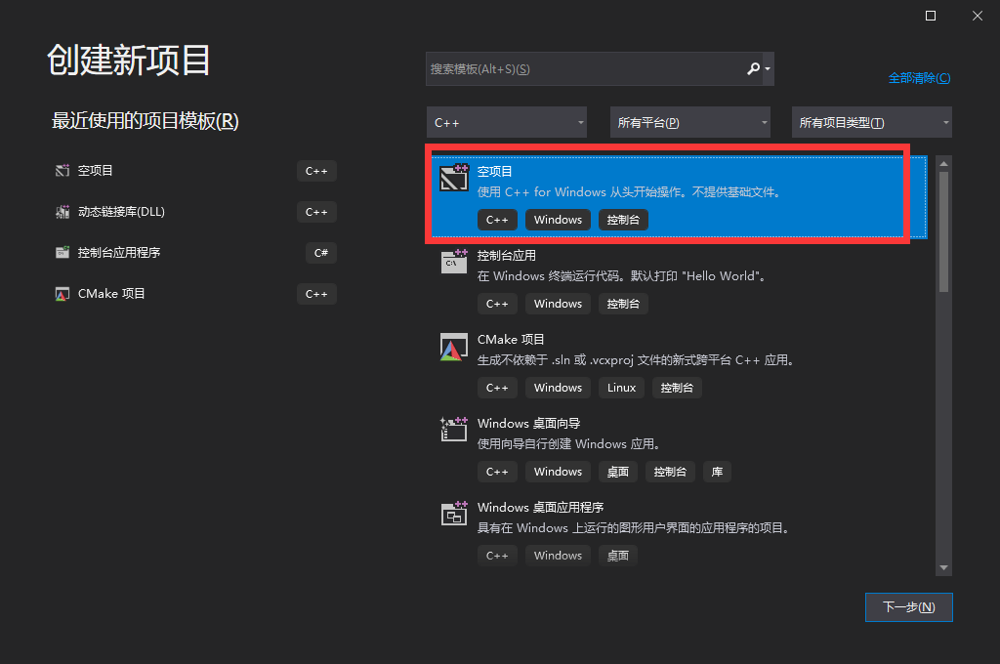
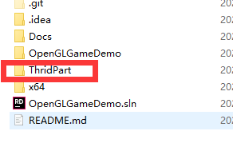
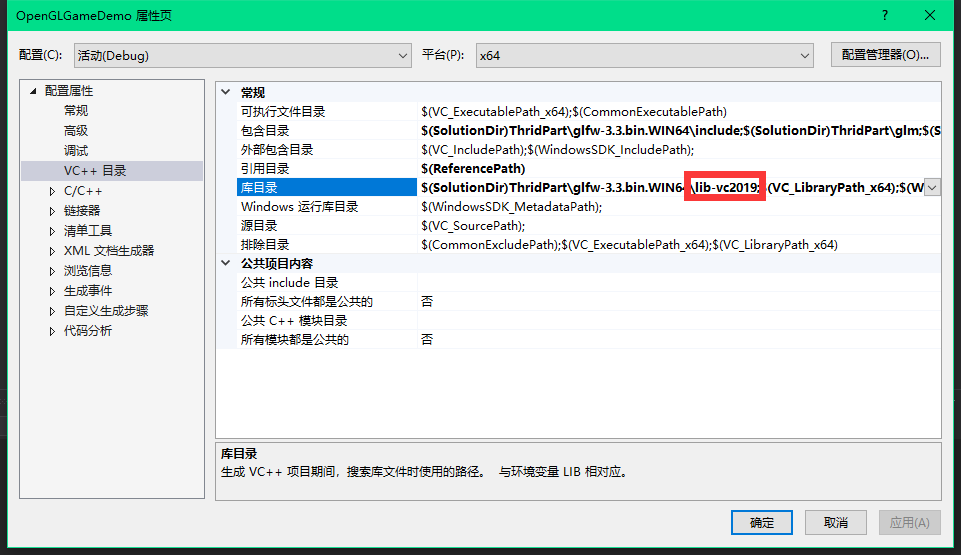

## 工程创建

创建一个空的`Console Application`
简单启动一下，没有问题就可以了！

## 基本的环境搭建

项目使用的是`GLFW`，具体的可以看看https://learnopengl-cn.github.io/01%20Getting%20started/02%20Creating%20a%20window/
照着这个区搭建一个简单的显示windows就可以了！

我这里简单划分了一下

设置一下引用的路径

这里需要注意一下自己使用的vs版本！我这里使用的是2019!

